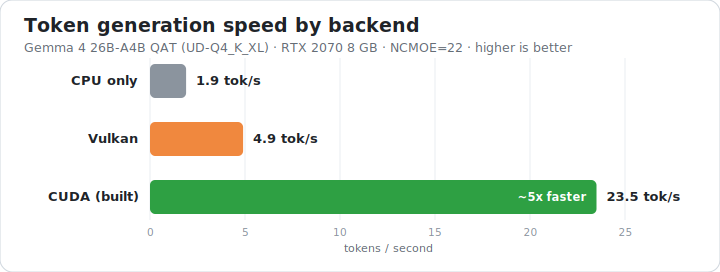
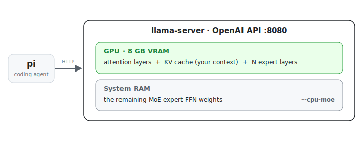

# Gemma 4 26B-A4B (QAT) locally on an 8 GB GPU, driven by `pi`


Run Google's **Gemma 4 26B-A4B** mixture-of-experts model (26B total / **4B active**
parameters), in the unsloth **QAT** 4-bit GGUF (~14 GB), on a laptop with an **8 GB**
NVIDIA GPU — and use it as the backend for [`pi`](https://github.com/badlogic/pi-mono)
(a local coding agent).

<p align="center"></p>

> ⚡ **Want the most tokens/sec? Use the CUDA backend.** It is **~5× faster** than the zero-build
> Vulkan default (~23.5 vs ~4.9 tok/s here). Build it once with `scripts/build-llama-cuda.sh`
> (or `BACKEND=cuda bash scripts/setup.sh`). Once built, the run scripts **auto-select CUDA** —
> no need to pass `BACKEND=cuda` each time. Vulkan is only the *fallback* when there is no CUDA
> build (it needs none and works on any driver) — not the fast path. The launch banner tells you
> which one is live: 🟢 CUDA / 🟡 Vulkan / 🔴 CPU.

The trick is llama.cpp's **`--cpu-moe`** flag: it pins the heavy MoE expert weights to
system RAM while keeping the attention layers, the **KV cache (your context)**, and — VRAM
permitting — a few expert layers on the GPU. A 14 GB model that can't possibly fit in 8 GB of
VRAM then runs comfortably, because only ~4B params are active per token.

<p align="center"></p>

Only the expert FFN weights move to RAM; the context (KV cache) stays in VRAM, which is why context
length and on-GPU experts share the 8 GB budget (see [tuning](#performance--tuning)).

> 📖 For the full engineering story — architecture, the CUDA-version wall, the build, the
> performance analysis, and every caveat — see **[docs/TECHNICAL.md](docs/TECHNICAL.md)**.

---

## TL;DR

**Fastest (recommended) — CUDA backend (~23.5 tok/s):**

```bash
BACKEND=cuda bash scripts/setup.sh    # env + model + build llama.cpp vs your CUDA (~20 min, once)
bash scripts/configure-pi.sh          # register the pi provider (once)
BACKEND=cuda bash scripts/start.sh    # server + pi
```

**Zero-build — Vulkan backend (~4.9 tok/s), works on any driver:**

```bash
bash scripts/setup.sh                 # env + model (~14 GB), no compile
bash scripts/configure-pi.sh          # register the pi provider (once)
bash scripts/start.sh                 # server + pi
```

> **Don't want to memorize env vars? Use the guided setup —** `bash scripts/start.sh --menu`
> walks you through backend, **auto-tune vs manual**, context, KV-cache quantization, sampling
> and image input, then launches the server and pi with your picks. It also **syncs pi's context
> window to the server's** automatically (so a 128K server doesn't end up with a 32K client).
> Everything it sets is also a plain env var (see [Useful overrides](#useful-overrides) and
> [Performance & tuning](#performance--tuning)), so the menu is a convenience, never the only way.

> **Backend auto-detection:** once you've built the CUDA backend, the run scripts pick it up
> automatically — you no longer need to pass `BACKEND=cuda` every time. Without a CUDA build they
> fall back to Vulkan. Override either way with `BACKEND=cuda|vulkan|cpu`.
>
> At launch the server prints a **color-coded banner** so you can see the active backend at a
> glance: 🟢 **green = CUDA** (fast), 🟡 **yellow = Vulkan** (slow MoE path), 🔴 **red = CPU-only**.
> If you expected CUDA but see yellow, your build is missing — run `scripts/build-llama-cuda.sh`.

Prefer to run the two halves yourself instead of `start.sh`:

```bash
BACKEND=cuda bash scripts/run-server.sh   # terminal A: start the server (drop BACKEND for Vulkan)
bash scripts/run-pi.sh                     # terminal B: chat through pi
bash scripts/stop-server.sh                # when done: stop the server
```

---

## Tested configuration

| | |
|---|---|
| **Model** | `unsloth/gemma-4-26B-A4B-it-qat-GGUF` → `gemma-4-26B-A4B-it-qat-UD-Q4_K_XL.gguf` (~14 GB) |
| **GPU** | NVIDIA RTX 2070 Max-Q, **8 GB VRAM**, driver **535** (CUDA 12.2) |
| **RAM** | 31 GB (16 GB is enough) |
| **CPU** | Intel Core i7-8750H |
| **Backend** | llama.cpp — **Vulkan** (zero-build) or **CUDA** (built from source, ~5–6× faster) |
| **Result** | reasoning + tool-calls work; **~4.9 tok/s on Vulkan, ~23.5 tok/s on CUDA** |

---

## The model

| | |
|---|---|
| **Repo** | [`unsloth/gemma-4-26B-A4B-it-qat-GGUF`](https://huggingface.co/unsloth/gemma-4-26B-A4B-it-qat-GGUF) on Hugging Face |
| **File** | `gemma-4-26B-A4B-it-qat-UD-Q4_K_XL.gguf` (~14 GB) |
| **What** | Gemma 4 26B-total / 4B-active MoE, **QAT** (quantization-aware-trained) 4-bit, unsloth "UD" dynamic quant |

**You don't download it manually — `scripts/setup.sh` fetches it for you** (via
`huggingface_hub` into `models/`, ~14 GB). The repo is **public**, so no Hugging Face
account or token is required.

The QAT repo ships **only this one 4-bit file** (QAT is trained for 4-bit). For other
precisions, use the **non-QAT** repo
[`unsloth/gemma-4-26B-A4B-it-GGUF`](https://huggingface.co/unsloth/gemma-4-26B-A4B-it-GGUF/tree/main),
which has the full Q2–Q8 range (Q5 ≈ 21 GB, Q6 ≈ 23 GB, Q8 ≈ 27 GB).

**Use a different quant or your own file:**

```bash
# a higher-precision quant of the SAME model (better quality, more RAM, SLOWER; non-QAT repo)
MODEL_REPO=unsloth/gemma-4-26B-A4B-it-GGUF \
MODEL_FILE=gemma-4-26B-A4B-it-UD-Q6_K_XL.gguf bash scripts/setup.sh

# already have a GGUF somewhere? skip the download and point the server at it
MODEL=/path/to/model.gguf bash scripts/run-server.sh
```

(A bigger quant scales up the GPU-resident tensors too, so fewer expert layers fit in VRAM and the
RAM-resident ones are heavier — expect *slower* generation, not the same ~23 tok/s. Details in
[TECHNICAL.md §13](docs/TECHNICAL.md#13-running-bigger-models).)

See [docs/TECHNICAL.md](docs/TECHNICAL.md#13-running-bigger-models) for what fits in your RAM and
whether a bigger Gemma 4 is worth it.

---

## The CUDA-vs-Vulkan gotcha

The model is served by **llama.cpp's `llama-server`** — we need it for `--cpu-moe`, which
ollama doesn't offer ([details](docs/TECHNICAL.md#5-why-not-ollama)). `pi` reaches it over the
OpenAI-compatible API, like any other backend.

The one non-obvious snag was getting the GPU backend to run at all. The conda-forge `llama.cpp`
package ships CUDA **12.9** / **13.0** builds. On a driver that only supports CUDA 12.2 (e.g.
driver 535), the CUDA kernels fail at load with:

```
CUDA error: device kernel image is invalid
```

CUDA *minor-version compatibility* covers the runtime **API**, but the compiled **SASS
kernels** from 12.9 are too new for the 12.2 driver to load. **Two fixes:**

1. **Zero-build:** run the **Vulkan** backend (`--device VulkanN`), which uses the driver's own
   ICD and has no CUDA-version wall. `--cpu-moe` is backend-agnostic. This is the default in
   `scripts/run-server.sh`. Works immediately, but slower (~4–5 tok/s here).
2. **~5–6× faster:** build llama.cpp from source against *your driver's own* CUDA version with
   `scripts/build-llama-cuda.sh`, then `BACKEND=cuda bash scripts/run-server.sh`. On this RTX
   2070 this took generation from ~4.9 → ~23.5 tok/s — the Vulkan MoE path, not RAM bandwidth,
   was the bottleneck. See [Performance & tuning](#performance--tuning).

---

## Prerequisites

- **mamba / conda** ([Miniforge](https://github.com/conda-forge/miniforge)). All other
  dependencies are installed into dedicated envs by the scripts, or from the manifests:
  - **Runtime:** `mamba env create -f environment.yml` (llama.cpp + Vulkan + `huggingface_hub`).
    `scripts/setup.sh` does the same and also downloads the model.
  - **Build (optional, native CUDA):** `mamba env create -f environment-build.yml` (CUDA toolkit +
    compiler + cmake). Pinned to CUDA 12.2 — adjust to your driver, or just run
    `scripts/build-llama-cuda.sh` which auto-detects.
- An NVIDIA GPU with a working driver (the driver provides the Vulkan ICD).
- ~14 GB free disk for the model, and ≥16 GB system RAM.
- An internet connection for the first run (downloads the ~14 GB model + conda packages).
- [`pi`](https://github.com/badlogic/pi-mono) if you want the agent front-end
  (`npm i -g @mariozechner/pi-coding-agent`). Not required just to run the server.
- **Only for the optional CUDA build** (`build-llama-cuda.sh`): `git`, ~4 GB extra disk for the
  CUDA toolchain, and ~20 min to compile. Everything (toolkit, compiler) is auto-installed into
  an isolated conda env — nothing system-wide.

---

## Scripts

| Script | What it does |
|---|---|
| `scripts/setup.sh` | **(once)** Creates the `llamacpp` conda env (llama.cpp + huggingface_hub) and downloads the GGUF into `models/`. `BACKEND=cuda` also builds the native CUDA backend. Idempotent. |
| `scripts/configure-pi.sh` | **(once)** Adds the `llamacpp` provider to `~/.pi/agent/models.json` from `config/pi-provider.json`. |
| `scripts/start.sh` | **All-in-one:** starts the server (if not already up) — showing the CUDA/Vulkan/CPU banner — waits for it to load, then launches pi. Pass **`--menu`** for a guided setup that walks every knob (backend, auto-tune vs manual, context, `KVQUANT`, sampling, image) and launches with your picks. Otherwise set knobs as env vars: passes `BACKEND`/`NCMOE`/`CTX`/`KVQUANT`/`TEMP`/`--image` through; other args go to pi. On the **first** fresh launch it offers to **auto-tune** (runs `benchmark-config.sh` once, then remembers the result): with no `CTX` set it sweeps context sizes and lets you pick one; with `CTX=` pinned it tunes the expert split for that context (`AUTOTUNE=1` re-run, `0` off). When pi exits, if it started the server it offers to stop it (interactive prompt; force with `STOP_ON_EXIT=1`/`0`). A server that was already running is left alone. |
| `scripts/run-server.sh` | Launches `llama-server` with `--cpu-moe`, `--no-mmap`, `-c 32768`, `--jinja`, on `127.0.0.1:8080`. Auto-selects CUDA if built, else Vulkan; prints a color-coded backend banner at launch. Override with `BACKEND=cuda\|vulkan\|cpu`. `KVQUANT=q8_0` quantizes the KV cache (long-context lever). Pass `--image` to enable vision (loads the `mmproj`). |
| `scripts/run-pi.sh` | Launches pi against the local server (`--provider llamacpp --model gemma-4-26b-a4b-qat`). Extra args pass through to pi. |
| `scripts/stop-server.sh` | Stops the server by the port it listens on (default 8080). |
| `scripts/build-llama-cuda.sh` | **(optional, ~5–6× faster)** Builds llama.cpp from source against your driver's CUDA version into a `llamacpp-cuda` env. Auto-detects CUDA + GPU arch, smoke-tests the result. |
| `scripts/benchmark-config.sh` | **(optional)** Finds the fastest `NCMOE`/`CTX` for *your* GPU: probes real configs on an isolated port and prints the fastest that fits per context. Times each config `RUNS` times (default 5) and reports the **median** (with min–max spread) to smooth out GPU-clock noise, showing live `runs: 1/5 …` progress. Pin one context with `CTX=` or sweep `CTX_LIST`. |
| `config/pi-provider.json` | The pi provider definition (copy into `models.json` manually if you prefer). |

All scripts accept env-var overrides — see the header comment in each, or run any of them with
`-h`/`--help` to print that header.

### Useful overrides

```bash
NCMOE=22    bash scripts/run-server.sh    # FASTEST on 8 GB: 8 expert layers on GPU (default is all-CPU experts)
CTX=65536   bash scripts/run-server.sh    # bigger context (see the ceiling table below)
BACKEND=cuda bash scripts/run-server.sh   # force native CUDA backend (auto-selected once built)
BACKEND=cpu bash scripts/run-server.sh    # no GPU offload — slow, benchmark baseline only
PORT=9000   bash scripts/run-server.sh    # different port
CTX=131072 KVQUANT=q8_0 bash scripts/run-server.sh   # quantize the KV cache to fit long context
bash scripts/run-server.sh --image        # enable image input (CLI flag, not an env var)
```

These env vars work on **`run-server.sh`, `start.sh`, and `build-llama-cuda.sh`** alike (e.g.
`CTX=65536 NCMOE=27 BACKEND=cuda bash scripts/start.sh`).

### Images (vision)

Gemma 4 is natively multimodal, but the text GGUF doesn't carry the vision encoder — llama.cpp
needs a **separate multimodal projector** (`mmproj`). Download it once (~1.2 GB, BF16), then start
the server with `--image`:

```bash
curl -L -o models/gemma4-26b-a4b-qat/mmproj-BF16.gguf \
  https://huggingface.co/unsloth/gemma-4-26B-A4B-it-GGUF/resolve/main/mmproj-BF16.gguf
bash scripts/run-server.sh --image        # add NCMOE=22 BACKEND=cuda as usual
bash scripts/start.sh --image             # or all-in-one: --image is forwarded to the server
```

Now send images through the standard OpenAI vision format (`image_url` with a `data:image/...;base64,`
URI). Notes:

- **Vision only.** This projector is `gemma4v` — images, **not** audio. (Gemma 4 *can* do audio, but
  this BF16 file has no audio conformer; that needs a different/unified projector.)
- **Projector runs on the CPU** (`--no-mmproj-offload`): on 8 GB there's no VRAM left for a 1.2 GB
  BF16 tower beside the experts + KV. Image encoding is therefore CPU-bound, but decode stays ~full
  speed. Override the path with `MMPROJ=…` if you keep the file elsewhere.
- Without `--image` the server is **text-only** — the projector is never loaded.

**Context size.** The context window is `CTX` (**default 32768** = 32K; model max **262144**). The
context is the KV cache, and it lives in **VRAM**, not RAM (only the expert weights are offloaded) —
so it shares the 8 GB with the attention weights and on-GPU experts. **More context means fewer
experts on the GPU, which means slower** — context trades directly against speed:

| Goal | Setting | Max context on 8 GB | Speed |
|---|---|---|---|
| **Full speed** (recommended on 8 GB) | `NCMOE=22` | **~32K** | ~23 tok/s |
| Balance | `NCMOE=27`, etc. | ~64K | medium |
| **Max context** (script default) | `--cpu-moe` (omit `NCMOE`) | **~128K** (≈160K ceiling) | slower (all experts on CPU) |

(The KV cache itself is tiny — ~0.6 GB at 16K — thanks to flash attention and Gemma's
sliding-window layers, and its size is **independent of the quant**. 256K, the model's trained max,
does not fit on 8 GB.) If you change `CTX`, pass the **same** value to `configure-pi.sh`:

```bash
# e.g. a 128K window (slower): all experts to RAM, big context
CTX=131072 bash scripts/start.sh
CTX=131072 bash scripts/configure-pi.sh   # keep pi's contextWindow in sync with the server's -c
```

**Quantize the KV cache for long context (`KVQUANT`).** Above, "KV size is independent of the
*weight* quant" — but you can quantize the **KV cache itself** to shrink it in VRAM, freeing room for
more context or more on-GPU experts. `KVQUANT=q8_0` (near-lossless) roughly halves the KV cache;
`q5_1`/`q4_0` go further but cost quality. It's a **long-context lever** — at 32K the KV cache is
already ~0.6 GB so it barely matters. Quantizing the V cache requires flash attention, so `KVQUANT`
forces `-fa on` automatically. `KVQUANT` is also a dimension of the auto-tune cache, so the tuned
expert split is measured separately per KV-quant setting.

Measured here (CUDA, RTX 2070 8 GB) — the freed VRAM lets *more* expert layers onto the GPU, so the
win is both **bigger usable context** and **higher tok/s**:

| Context | f16 (off) | `KVQUANT=q8_0` | Gain |
|---|---|---|---|
| 65536 | `NCMOE=22` → 26.1 tok/s | `NCMOE=20` → **30.5 tok/s** | **+17%** |
| 131072 | `NCMOE=27` (only fit) → 19.5 tok/s | `NCMOE=22` → **27.0 tok/s** | **+38%** |

At 128K, f16's KV cache is so large that *only* the slow all-but-three-layers-on-CPU split fits;
`q8_0` shrinks it ~2 GB and makes the fast split fit. Same 4-bit model weights in both columns —
only the KV-cache precision changes. (tok/s measured at low context fill — use it to rank.)

```bash
CTX=131072 KVQUANT=q8_0 bash scripts/start.sh   # 128K context with a quantized KV cache
```

(Best on the CUDA backend; on Vulkan, flash-attention + KV-quant can be slow — the server warns.)

**Sampling (temperature & friends).** Set these on the **server** via env vars; they become the
defaults for every request. The defaults follow [unsloth's Gemma 4
recommendation](https://unsloth.ai/docs/models/gemma-4/qat): `TEMP=1.0`, `TOP_P=0.95`, `TOP_K=64`.

```bash
TEMP=0.7 bash scripts/start.sh                              # more deterministic
TEMP=1.0 TOP_P=0.95 TOP_K=64 bash scripts/start.sh          # the defaults, explicit
EXTRA_ARGS="--min-p 0.01 --repeat-penalty 1.1 --seed 42" bash scripts/start.sh   # anything else
```

(`pi` doesn't expose sampling flags, so the server is where you set them. An OpenAI client that
*does* send `temperature`/`top_p` overrides the server default for that request.)

### Performance & tuning

The model is **30 layers, 128 experts/layer, top-8 routing**; in this quant each layer's
experts are ~0.45 GB. `--n-cpu-moe N` (env `NCMOE=N`) keeps the **first N** layers' experts
on CPU and puts the rest on the GPU — fewer on CPU = faster but more VRAM.

Measured on the RTX 2070 (8 GB) at `CTX=16384`, `NCMOE=22` (8 layers' experts on GPU),
same model, same llama-bench:

| Backend | Prompt (pp) | **Generation (tg)** |
|---|---|---|
| CPU only (no GPU) | 3.1 t/s | ~1.9 t/s |
| Vulkan (stock conda build) | 47 t/s | ~4.4 t/s |
| **CUDA (built from source)** | 63 t/s | **~25 t/s** |

Real server-side (what pi sees): **Vulkan ~4.9 tok/s → CUDA ~23.5 tok/s.**

**The CUDA backend is ~5–6× faster — build it if your driver allows.** The default Vulkan
backend exists only because the *prebuilt* conda CUDA package targets a newer CUDA than older
drivers can load. Once you build llama.cpp against your own driver's CUDA (one command,
`scripts/build-llama-cuda.sh`), the CUDA backend runs and is dramatically faster — on this
Turing GPU the Vulkan MoE path, not RAM bandwidth, was the real bottleneck.

```bash
bash scripts/build-llama-cuda.sh        # auto-detects your CUDA + GPU arch, ~20 min
NCMOE=22 BACKEND=cuda bash scripts/run-server.sh
```

**Why MoE makes this feasible at all:** only **8 of 128 experts fire per token**, so each token
streams only a few tens of MB of expert weights from RAM — light enough that RAM bandwidth is
*not* the limiting factor here. With CUDA doing attention + the GPU-resident experts efficiently,
~25 tok/s is reached even with 22 of 30 layers' experts still in RAM.

`NCMOE=22` leaves ~1.2 GB VRAM headroom — about the limit on an 8 GB card once the desktop is
using some VRAM. If you hit out-of-memory, raise `NCMOE` (e.g. 24) or lower `CTX`.

**Don't want to guess? Let the script find it.** `scripts/benchmark-config.sh` probes real
configs on *your* GPU and reports the fastest `NCMOE` that fits for each context — measuring
the same server-side tok/s that pi sees. Pin a context and optimise for it, or sweep a range:

```bash
CTX=32768 bash scripts/benchmark-config.sh                 # optimise NCMOE for a 32K window
CTX_LIST=16384,32768,65536 bash scripts/benchmark-config.sh   # sweep several contexts
```

It runs on an isolated port (8099), so it won't disturb a server you already have on 8080.
Each config is timed **`RUNS` times (default 5) and reported as the median** — the GPU's boost clock
bounces between probes, so one sample is noisy; the median makes the picks stable, and the min–max
spread is shown so you can see the noise. It prints live progress (`runs: 1/5 2/5 …`) as it goes.
The reported tok/s is measured at *low* context fill (it deliberately doesn't prefill 128K) —
use it to rank configs; real throughput drops as the context fills.

**Or just let `start.sh` ask.** The first time you launch a fresh server, `start.sh` offers to run
this measurement once and then **remembers** the result (in a gitignored cache) so later launches
reuse it instantly — no re-measuring. It has two modes:

- **No `CTX` set (default):** it **sweeps several context sizes** (`CTX_LIST`) and shows the fastest
  split that fits at each, then lets you **pick which context to launch with**. Your pick is
  remembered.
- **`CTX=` pinned:** it tunes only the expert split (`NCMOE`) for that one context.

Skip it with `AUTOTUNE=0`, force a fresh sweep with `AUTOTUNE=1`, widen the grid with
`CTX_LIST=`/`NCMOE_LIST=`, or set `NCMOE=` yourself to bypass it entirely.

**Or drive all of this from one menu.** `bash scripts/start.sh --menu` is a guided front-end to
everything above: it asks for the backend, then **auto-tune vs manual** (auto-tune reuses or runs
exactly this measurement; manual lets you type `CTX`/`NCMOE` directly), then `KVQUANT`, sampling,
and image input — and launches with your choices. It sets the same env vars described here, so
anything the menu does you can also do non-interactively on the command line.

The menu also runs `configure-pi.sh` for you, so pi's context window matches the server's `-c`
without a second command. On the **env-var path** that sync isn't automatic — if you launch with
`CTX=131072` directly, also run `CTX=131072 bash scripts/configure-pi.sh` once, or pi caps the
usable context at its previously configured window (32768 by default).

---

## Using it without pi

`llama-server` exposes a standard OpenAI API, so any client works:

```bash
curl -s http://127.0.0.1:8080/v1/chat/completions \
  -H "Content-Type: application/json" \
  -d '{"model":"gemma-4-26b-a4b-qat",
       "messages":[{"role":"user","content":"What is 17 times 23? Answer briefly."}],
       "max_tokens":600}' | python3 -m json.tool
```

**Reasoning note:** Gemma 4 thinks before answering. llama.cpp returns the chain-of-thought
in a separate `reasoning_content` field and the final answer in `content`. Give it a
generous `max_tokens` — too small and the thinking consumes the whole budget, leaving
`content` empty. `pi` handles this automatically.

There's also a built-in web UI at <http://127.0.0.1:8080>.

---

## Troubleshooting

| Symptom | Fix |
|---|---|
| `CUDA error: device kernel image is invalid` | Your driver is older than the build's CUDA version. Use the default Vulkan backend (don't set `BACKEND=cuda`). |
| Server picks the wrong / integrated GPU | Check `mamba run -n llamacpp llama-server --list-devices`; set `BACKEND=vulkan` (auto-detects NVIDIA) or pass the device explicitly. |
| Out of VRAM at startup | Lower `CTX`. (Note: `NCMOE` moves experts *onto* the GPU, so it uses *more* VRAM, not less.) |
| Empty `content` in API responses | Increase `max_tokens` — reasoning is eating the budget. |
| `mamba: command not found` | Activate your conda base env or add mamba to PATH before running the scripts. |

---

## Repository layout

```
.
├── README.md                 # this file
├── environment.yml           # conda/mamba runtime deps (Vulkan path)
├── environment-build.yml     # conda/mamba build toolchain (native CUDA build)
├── scripts/
│   ├── setup.sh              # env + model download
│   ├── configure-pi.sh       # register provider in pi
│   ├── start.sh              # all-in-one: server (if needed) + pi
│   ├── run-server.sh         # launch llama-server (auto CUDA/Vulkan; --image for vision)
│   ├── run-pi.sh             # launch pi against the local server
│   ├── stop-server.sh        # stop the server
│   ├── build-llama-cuda.sh   # build llama.cpp against the local CUDA (optional, ~5-6x faster)
│   ├── benchmark-config.sh   # probe NCMOE/CTX configs, recommend the fastest that fits (optional)
│   ├── _banner.sh            # shared backend banner + resolution (sourced by the above)
│   ├── _tuning.sh            # shared auto-tune cache: remembers the best NCMOE per backend+context
│   └── make-speed-chart.py   # regenerate docs/speed.svg from measured numbers
├── utils/
│   ├── inspect-gguf.sh       # report a GGUF's architecture / modality / tensors
│   └── inspect-gguf.py       #   (the implementation; .sh runs it in the env)
├── config/
│   └── pi-provider.json      # pi provider definition
├── docs/
│   ├── TECHNICAL.md          # engineering write-up (architecture, perf, multimodal)
│   └── speed.svg             # backend speed comparison chart (in the README)
├── models/                   # downloaded GGUF lives here (gitignored)
└── vendor/                   # llama.cpp source + CUDA build (gitignored)
```
